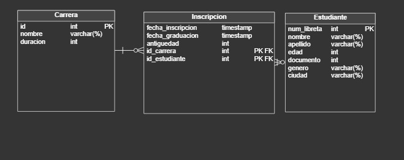

# Trabajos Practicos Integradores de Arquitectura Web TUDAI 2025

# IMPORTANTE!
- El TPE de Microservicios se encuentra en el siguiente repositorio:
[TPE Microservicios](https://github.com/FdezCarlomagno/tpe-microservicios)


---

- Integrantes:
  - Valentin F. Carlomagno
  - Tomas Rios
  - Florencia Bianco
  - Micaela Díaz
  - Matias Gatti

- Grupo: 23

---

Diagrama Entidad Relación (DER) TP2:



# API REST - Sistema de Gestión de Inscripciones Universitarias

Esta API permite gestionar **Estudiantes**, **Carreras** e **Inscripciones** universitarias.  
Incluye operaciones CRUD básicas y consultas personalizadas.

---

## Tabla de Endpoints

| Recurso           | Método | Endpoint                                    | Descripción                                                   |
|--------------------|--------|----------------------------------------------|----------------------------------------------------------------|
| Estudiantes        | GET    | `/api/estudiantes`                          | Lista todos los estudiantes                                   |
| Estudiantes        | GET    | `/api/estudiantes/ordered`                  | Lista estudiantes ordenados por apellido y nombre              |
| Estudiantes        | POST   | `/api/estudiantes`                          | Crea un nuevo estudiante                                      |
| Inscripciones      | GET    | `/api/inscripciones`                        | Lista todas las inscripciones                                 |
| Inscripciones      | GET    | `/api/inscripciones/{id}`                   | Busca una inscripción por ID                                  |
| Inscripciones      | POST   | `/api/inscripciones`                        | Crea una nueva inscripción                                    |
| Inscripciones      | GET    | `/api/inscripciones/estudiantes/carrera`    | Lista estudiantes de una carrera, con filtro opcional por ciudad |
| Inscripciones      | GET    | `/api/inscripciones/carreras/inscriptos`    | Lista carreras ordenadas por cantidad de inscriptos           |

---

## Estudiantes

### 📄 GET `/api/estudiantes`
Obtiene la lista de estudiantes.

#### ✅ Respuesta 200
```json
[
  {
    "nombre": "Ana",
    "apellido": "Gómez",
    "dni": 40555444,
    "numLibreta": 1001
  }
]
````

---

### GET `/api/estudiantes/ordered`

Obtiene la lista de estudiantes ordenados por `apellido` y `nombre`.

#### ✅ Respuesta 200

```json
[
  {
    "nombre": "Juan",
    "apellido": "Perez",
    "dni": 40000111,
    "numLibreta": 1002
  }
]
```

---

###  POST `/api/estudiantes`

Crea un nuevo estudiante.

#### Body (JSON)

```json
{
  "nombre": "Lucas",
  "apellido": "Martínez",
  "edad": 20,
  "documento": 40111222,
  "genero": "MALE",
  "ciudad": "Tandil",
  "numLibreta": 1003
}
```

#### ✅ Respuesta 202

```json
{
  "nombre": "Lucas",
  "apellido": "Martínez",
  "dni": 40111222,
  "numLibreta": 1003
}
```

---

## Inscripciones

### GET `/api/inscripciones`

Lista todas las inscripciones.

#### ✅ Respuesta 200

```json
[
  {
    "estudiante": {
      "nombre": "Lucas",
      "apellido": "Martínez",
      "dni": 40111222,
      "numLibreta": 1003
    },
    "carrera": {
      "id": 1,
      "nombre": "Ingeniería en Sistemas",
      "duracion": 5
    },
    "fechaInscripcion": "2025-03-01T00:00:00",
    "fechaGraduacion": null,
    "antiguedad": 1
  }
]
```

---

### GET `/api/inscripciones/{id}`

Busca una inscripción por su ID.

#### ✅ Respuesta 200

```json
{
  "estudiante": {
    "nombre": "Lucas",
    "apellido": "Martínez",
    "dni": 40111222,
    "numLibreta": 1003
  },
  "carrera": {
    "id": 1,
    "nombre": "Ingeniería en Sistemas",
    "duracion": 5
  },
  "fechaInscripcion": "2025-03-01T00:00:00",
  "fechaGraduacion": null,
  "antiguedad": 1
}
```

---

### POST `/api/inscripciones`

Crea una nueva inscripción.

#### Body (JSON)

```json
{
  "estudianteId": 3,
  "carreraId": 1,
  "fechaInscripcion": "2025-03-01T00:00:00"
}
```

#### ✅ Respuesta 200

```json
{
  "estudiante": {
    "nombre": "Lucas",
    "apellido": "Martínez",
    "dni": 40111222,
    "numLibreta": 1003
  },
  "carrera": {
    "id": 1,
    "nombre": "Ingeniería en Sistemas",
    "duracion": 5
  },
  "fechaInscripcion": "2025-03-01T00:00:00",
  "fechaGraduacion": null,
  "antiguedad": 0
}
```

---

### GET `/api/inscripciones/estudiantes/carrera`

Lista los estudiantes inscriptos a una carrera específica, con filtro opcional por ciudad.

#### Query Params

| Parametro | Tipo   | Obligatorio | Descripción                   |
| --------- | ------ | ----------- | ----------------------------- |
| carreraId | Long   | ✅           | ID de la carrera              |
| ciudad    | String | ❌           | Filtrar por ciudad específica |

#### Ejemplo

```
GET /api/inscripciones/estudiantes/carrera?carreraId=1&ciudad=Tandil
```

#### ✅ Respuesta 200

```json
[
  {
    "nombre": "Ana",
    "apellido": "Gómez",
    "dni": 40555444,
    "numLibreta": 1001
  }
]
```

---

### GET `/api/inscripciones/carreras/inscriptos`

Obtiene la lista de carreras ordenadas por cantidad de inscriptos.

#### ✅ Respuesta 200

```json
[
  {
    "id": 1,
    "nombre": "Ingeniería en Sistemas",
    "duracion": 5,
    "inscriptos": 230
  },
  {
    "id": 2,
    "nombre": "Derecho",
    "duracion": 5,
    "inscriptos": 120
  }
]
```

